# Agent Team Operation Sequence

この図は、`cc-agent-team` の標準運用フローを CEO 起点で表したシーケンス図です。

## Main Flow

```mermaid
sequenceDiagram
    autonumber
    actor Human
    participant CEO
    participant AR as Agent Router
    participant KM as Knowledge Manager
    participant CG as Context Graph
    participant REQ as Requirements Analyst
    participant ARCH as Architect
    participant TL as Tech Lead
    participant ARCH_EVAL as Architect Evaluator
    participant UIUX as UI/UX Designer
    participant DBA as Database Specialist
    participant SRE as SRE Expert
    participant DESIGN_EVAL as Design Evaluator
    participant PM as Project Manager
    participant FE as Frontend Expert
    participant BE as Backend Expert
    participant INFRA as Infrastructure Expert
    participant CICD as CI/CD Engineer
    participant REV as Reviewer
    participant SEC as Security Expert
    participant TEST as Tester
    participant QA as QA Lead
    participant DOC as Document Writer

    Human->>CEO: 要件・制約・期待成果を提示

    Note over CEO,REQ: Phase 0: Requirements + Gate 0
    CEO->>AR: 要件定義を依頼（ヒアリング生データ）
    AR->>REQ: PRD・受入基準・スコープ構造化をディスパッチ
    REQ-->>AR: docs/requirements/* を返却
    AR-->>CEO: Phase 0 結果を集約
    CEO->>CEO: Gate 0 要件確認（受入基準・スコープ・設計ブロッカーOpen Questions）
    CEO-->>Human: Gate 0通過を報告（設計ブロッカー未解消時のみ人間に確認）

    CEO->>AR: ARCH/TL の初期設計を依頼（REQ要件定義を起点）
    par Architecture
        AR->>ARCH: 構造設計をディスパッチ
        ARCH-->>AR: docs/architecture/* を返却
    and Tech Design
        AR->>TL: 技術選定と規約策定をディスパッチ
        TL-->>AR: tech-stack, api-design, ADR を返却
    end
    AR-->>CEO: Phase 1 結果を集約

    Note over CEO,ARCH_EVAL: Gate 1: Architecture Evaluation Loop
    CEO->>ARCH_EVAL: ARCH+TL成果物の評価を依頼
    ARCH_EVAL-->>CEO: APPROVE or REJECT（修正指示付き）

    loop ARCH-EVAL REJECT時
        CEO->>AR: 修正指示を対象Agent(ARCH/TL)に伝達
        AR->>ARCH: 修正をディスパッチ
        ARCH-->>AR: 修正結果
        AR->>TL: 修正をディスパッチ（必要な場合）
        TL-->>AR: 修正結果
        AR-->>CEO: 修正完了
        CEO->>ARCH_EVAL: 再評価を依頼
        ARCH_EVAL-->>CEO: APPROVE or REJECT
    end

    alt Gate 1 Approved (ARCH-EVAL APPROVE)
        CEO-->>Human: Gate 1通過を報告
        CEO->>KM: 初期コンテキスト生成を依頼
        KM-->>CEO: project context / decision registry / cg-request.md
        CEO->>CG: KM成果物 + cg-request.md を基に依存関係を初期化
        CG-->>CEO: entity graph / module deps

        CEO->>AR: UIUX / DBA / DOC / INFRA / CICD / SRE を計画
        par UI and UX
            AR->>UIUX: 画面設計とデザインシステムを依頼
            UIUX-->>AR: docs/design/* を返却
        and Database
            AR->>DBA: スキーマ設計を依頼
            DBA-->>AR: docs/database/*, migrations を返却
        and Terminology
            AR->>DOC: 用語集・設計書骨子の統一を依頼
            DOC-->>AR: docs/glossary.md を返却
        and Infra
            AR->>INFRA: IaC / Docker 方針を依頼
            INFRA-->>AR: infrastructure/* を返却
        and Pipeline
            AR->>CICD: CI/CD 方針を依頼
            CICD-->>AR: .github/workflows/* を返却
        and Reliability
            AR->>SRE: SLO/可観測性/ロールバック設計を依頼
            SRE-->>AR: docs/operations/{slo,monitoring-design,runbook,rollback-strategy,...} を返却
        end
        AR-->>CEO: Phase 1.5 結果を集約

        Note over CEO,AR: Phase 1.6 Design Quality Pre-check
        CEO->>AR: SEC / TEST / QA の設計レビューを依頼
        par Security Design Review
            AR->>SEC: 脅威モデル・認証認可方針をレビュー
            SEC-->>AR: 設計レビュー結果
        and Test Perspective Review
            AR->>TEST: 受入条件素案・境界条件を洗い出し
            TEST-->>AR: テスト観点レビュー結果
        and Test Strategy
            AR->>QA: テスト戦略・品質メトリクス目標を策定
            QA-->>AR: docs/quality/{test-strategy,quality-metrics} を返却
        end
        AR-->>CEO: Phase 1.6 結果を集約

        Note over CEO,DESIGN_EVAL: Gate 2: Design Evaluation Loop
        CEO->>DESIGN_EVAL: UIUX+DBA+SEC+TEST成果物の評価を依頼
        DESIGN_EVAL-->>CEO: APPROVE or REJECT（修正指示付き）

        loop DESIGN-EVAL REJECT時
            CEO->>AR: 修正指示を対象Agent(UIUX/DBA/SEC/TEST)に伝達
            par Revision
                AR->>UIUX: 修正をディスパッチ（必要な場合）
                UIUX-->>AR: 修正結果
            and Revision
                AR->>DBA: 修正をディスパッチ（必要な場合）
                DBA-->>AR: 修正結果
            end
            AR-->>CEO: 修正完了
            CEO->>DESIGN_EVAL: 再評価を依頼
            DESIGN_EVAL-->>CEO: APPROVE or REJECT
        end

        alt Gate 2 Approved (DESIGN-EVAL APPROVE)
            CEO-->>Human: Gate 2通過を報告
            CEO->>KM: 設計反映と矛盾検出を依頼（SEC/TEST結果含む）
            KM-->>CEO: context-fe, context-be, contradiction report, cg-request.md
            CEO->>CG: KM成果物 + cg-request.md を基にフロー・依存関係を更新
            CG-->>CEO: impact / flow / tech debt

            CEO->>AR: PM に WBS 作成を依頼
            AR->>PM: タスク分解・依存関係定義
            PM-->>AR: TASK-*.json, task-dependency-graph
            AR-->>CEO: 実装順序付き PLAN / REPLAN

            CEO->>KM: 実装Agent向けコンテキストを更新
            KM-->>CEO: 最新 context-{agent}.md

            CEO->>AR: DOC に設計概要初版を依頼
            AR->>DOC: docs/design-summary.md 初版作成
            DOC-->>AR: design-summary.md を返却

            CEO->>AR: 実装フェーズ開始
            AR->>DBA: 必要な migration を先行実施
            DBA-->>AR: migration 結果
            par Implementation
                AR->>BE: API / service / repository 実装
                BE-->>AR: backend/*, docs/api/*
            and Implementation
                AR->>FE: UI / state / API 結合実装
                FE-->>AR: frontend/*
            and Observability
                AR->>SRE: 監視設定コード実装（worktree、CICDとロールバック連携）
                SRE-->>AR: infrastructure/observability/*
            end

            CEO->>KM: 実装結果の知識同期
            KM-->>CEO: 差分コンテキスト / cg-request.md
            CEO->>CG: KM成果物を基に実コード依存を再解析
            CG-->>CEO: 更新済み graph / impact

            Note over CEO,AR: Phase 3: Quality Review Loop
            CEO->>AR: 品質フェーズ開始
            par Quality Checks
                AR->>REV: コードレビュー
                REV-->>AR: APPROVE or CHANGES_REQUESTED
            and Security Checks
                AR->>SEC: セキュリティレビュー
                SEC-->>AR: PASS or FAIL
            and Tests
                AR->>TEST: unit / integration / e2e
                TEST-->>AR: 全PASS or FAIL
            end
            AR-->>CEO: 品質結果を集約

            loop REV/SEC/TEST いずれか不合格時
                CEO->>KM: 不合格内容を知識化
                KM-->>CEO: 修正コンテキスト / cg-request.md
                CEO->>CG: 影響範囲を再分析
                CG-->>CEO: 修正対象を返却
                CEO->>AR: 該当実装Agent（FE/BE）に修正をディスパッチ
                par Revision
                    AR->>BE: 修正をディスパッチ（必要な場合）
                    BE-->>AR: 修正結果
                and Revision
                    AR->>FE: 修正をディスパッチ（必要な場合）
                    FE-->>AR: 修正結果
                end
                AR-->>CEO: 修正完了
                CEO->>AR: 不合格だったレビューAgentのみ再ディスパッチ
                par Re-review
                    AR->>REV: 再レビュー（CHANGES_REQUESTEDだった場合）
                    REV-->>AR: APPROVE or CHANGES_REQUESTED
                and Re-review
                    AR->>SEC: 再レビュー（FAILだった場合）
                    SEC-->>AR: PASS or FAIL
                and Re-review
                    AR->>TEST: 再テスト（FAILだった場合）
                    TEST-->>AR: 全PASS or FAIL
                end
                AR-->>CEO: 再レビュー結果を集約
            end

            Note over CEO,QA: Phase 3 末: QA 品質統括判定
            CEO->>AR: REV/SEC/TEST 結果の品質統括を依頼
            AR->>QA: 受入基準充足判定・品質メトリクス集約
            QA-->>AR: QA verdict (APPROVE / CHANGES_REQUESTED) + acceptance-report
            AR-->>CEO: QA 統括結果を集約
            alt QA CHANGES_REQUESTED
                Note over CEO: 未充足項目を品質修正ループ（上記loop）へ差し戻し
            end

            CEO->>AR: 文書整備を依頼
            AR->>DOC: README / runbook / changelog 更新
            DOC-->>AR: documentation result
            AR-->>CEO: リリース候補完成
            CEO-->>Human: 最終確認とリリース判断
        else Gate 2 Not Reached
            Note over CEO: Gate 2はDESIGN-EVALのAPPROVEまでループで処理済み
        end
    else Gate 1 Not Reached
        Note over CEO: Gate 1はARCH-EVALのAPPROVEまでループで処理済み
    end
```



## Key Rules

- `CEO` が直接ディスパッチするのは `AR`・`KM`・`CG`・`ARCH-EVAL`・`DESIGN-EVAL` の5つ
- `CG` は `CEO` から直接ディスパッチする（`KM` 内部からspawnしない）
- `CG` のディスパッチは必ず `KM` 完了後に行う（KM → cg-request.md → CEO → CG）
- `KM` は結果サマリーに `cg_required: true/false` を記載し、CEO が CG 実行要否を判断する
- `REQ` の受入基準確定・スコープ明示・設計ブロッカー Open Questions 解消（Gate 0: CEO要件確認）まで `ARCH/TL` を開始しない。REQ の要件定義が ARCH/TL 設計の起点（`REQ` は人間と直接対話せず、窓口は CEO）
- `ARCH-EVAL` が APPROVE するまで `UIUX/DBA` を開始しない（Gate 1）
- `DESIGN-EVAL` が APPROVE するまで `PM` を開始しない（Gate 2）
- `SRE` の SLO/可観測性設計（Phase 1.5）は Gate 1 承認後に AR 経由で開始可能（INFRA/CICD と同様、デザイン承認を待たない）。監視設定コード（`infrastructure/observability/`）は worktree 必須
- Phase 3 末で `QA` が `REV/SEC/TEST` 結果と受入基準充足を横断集約し、QA verdict（APPROVE/CHANGES_REQUESTED）を CEO に具申する。`QA` は独立ゲートではなく統括点で、合否の最終責任は CEO に残る。REV/SEC/TEST 全合格でも受入基準充足率が100%でなければ QA は CHANGES_REQUESTED を返す
- `docs/operations/` は SRE（slo/monitoring-design/runbook/rollback-strategy/capacity-plan/postmortem-template）と DOC（local-setup/deploy-guide/troubleshooting）でファイル単位に分担する
- Evaluator が REJECT した場合、CEO が修正指示を AR 経由で対象 Agent に伝え、修正後に再評価（APPROVE までループ）
- REJECT/FAIL の修正指示には `対象ファイル:行番号` を必須で含める
- REJECT/FAIL の修正指示には `再現手順/検証観点` と `検証コマンド` を必須で含める
- `.agent-team/reviews/*.json` は `.claude/shared/review-findings.schema.json` に準拠する
- `FE/BE` は `PM` の WBS 完了前に開始しない
- `BE` は `DBA` のスキーマ確定と migration 方針に従う
- `REV/SEC/TEST` の結果が NG の場合は `KM` → `CG` で原因分析 → `AR` 経由で `FE/BE` に修正ディスパッチ → 不合格だったレビューAgentのみ再実行（全合格までループ、上限3回。3回で解消しない場合は人間にエスカレーション）
- **FE/BE/INFRA/CICD は実装着手前に必ず git worktree を作成する**（`../cc-agent-harness-wt-{task-id}` / `claude/impl-{task-id}`）。メインツリーでの `frontend/` `backend/` `infrastructure/` `tests/` `.github/workflows/` への書き込みは PreToolUse フック (`.claude/scripts/hook-require-worktree.sh`) で exit 2 ブロックされる。AR は dispatch brief に `worktree_path` と `branch` を必ず含める。

## Responsibility Matrix

| Phase | Primary Owner | Supporting Agents | Main Outputs | Gate / Condition |
|------|---------------|-------------------|--------------|------------------|
| Intake | `CEO` | Human | 要件ヒアリング生データ | 要件受領 |
| **Phase 0 Requirements** | **`AR`** | **`REQ`** | **`docs/requirements/*`（PRD, user-stories, acceptance-criteria, scope, nfr-draft, open-questions, traceability-matrix）** | **Gate 0: CEO要件確認** |
| Phase 1 Architecture | `AR` | `ARCH`, `TL` | `docs/architecture/*`, `docs/adr/*` | ARCH-EVAL APPROVE |
| Phase 1.3 Knowledge Init | `CEO` | `KM` → `CG` | `.agent-team/knowledge/project-context.md`, `decision-registry.md`, `cg-request.md`, `graph/*` | Gate 1 approved |
| Phase 1.5 Design / Data / Terminology / Reliability | `AR` | `UIUX`, `DBA`, `DOC`, `INFRA`, `CICD`, `SRE` | `docs/design/*`, `docs/database/*`, `docs/glossary.md`, `infrastructure/*`, `.github/workflows/*`, `docs/operations/{slo,monitoring-design,runbook,rollback-strategy,...}` | Design complete |
| **Phase 1.6 Design Quality Pre-check** | **`AR`** | **`SEC`, `TEST`, `QA`** | **SEC: 脅威モデル・認証認可レビュー、TEST: 受入条件・境界条件、QA: テスト戦略・品質メトリクス目標（`docs/quality/*`）** | **Design quality verified** |
| Phase 1.7 Knowledge Sync | `CEO` | `KM` → `CG` | `context-{agent}.md`, `contradiction-report.md`, `cg-request.md`, updated graph（SEC/TEST結果含む） | DESIGN-EVAL APPROVE |
| Phase 1.9 Planning + Design Summary | `AR` | `PM`, `DOC` | `.agent-team/tasks/TASK-*.json`, task dependency graph, `PLAN/REPLAN`, `docs/design-summary.md` | WBS completed |
| Phase 2 Backend Foundation | `AR` | `DBA`, `BE` | migrations, `backend/*`, `docs/api/*` | DBA schema fixed |
| Phase 2 Frontend Implementation | `AR` | `FE` | `frontend/*` | UIUX approved and API/context ready |
| Phase 2 Platform / Observability Implementation | `AR` | `INFRA`, `CICD`, `SRE` | infra code, pipelines, `infrastructure/observability/*`（worktree） | architecture fixed |
| Phase 2 Knowledge Refresh | `CEO` | `KM` → `CG` | updated context, cg-request.md, impact analysis, module deps | implementation delta exists |
| Phase 3 Quality (Review Loop) + QA統括 | `AR` | `REV`, `SEC`(実装レビュー), `TEST`(テスト実装), `QA`(統括判定) | `.agent-team/reviews/*`, `tests/*`, `docs/quality/acceptance-report.md`, quality report | REV APPROVE + SEC PASS + TEST全PASS + QA verdict APPROVE（不合格時はループ） |
| Phase 4 Documentation | `AR` | `DOC` | `README.md`, `CHANGELOG.md`, `docs/operations/*` 最終整備 | Quality Gate通過 |
| Final Approval | `CEO` | Human | release decision | final review |

## Agent IO Matrix

| Agent | Triggered By | Depends On | Produces | Consumed By |
|------|--------------|------------|----------|-------------|
| `CEO` | Human | Requirements | dispatch decisions, gate requests | `AR`, `KM`, `ARCH-EVAL`, `DESIGN-EVAL`, Human |
| `AR` | `CEO` | dispatch brief, latest context | `PLAN/REPLAN`, specialist dispatches | all specialist agents, `CEO` |
| `KM` | `CEO` | docs, code, review artifacts | knowledge summaries, `context-{agent}.md`, contradiction report | `CEO`, `AR`, `CG`, implementation agents |
| `CG` | `CEO` | docs, code, knowledge summaries, `cg-request.md` | entity graph, module deps, impact analysis | `KM`, `AR`, quality/implementation agents |
| `ARCH-EVAL` | `CEO` | `docs/architecture/*`, `docs/adr/*`, requirements | APPROVE/REJECT + 評価レポート (`ARCH-EVAL-NNN.md`, `ARCH-EVAL-NNN.json`) | `CEO` (Gate 1 判定) |
| `DESIGN-EVAL` | `CEO` | `docs/design/*`, `docs/database/*`, SEC/TEST設計レビュー結果, `docs/architecture/*` | APPROVE/REJECT + 評価レポート (`DESIGN-EVAL-NNN.md`, `DESIGN-EVAL-NNN.json`) | `CEO` (Gate 2 判定) |
| `REQ` | `AR` | ヒアリング生データ、人間提供資料 | PRD, user stories, acceptance criteria, scope, NFR draft, open questions, traceability matrix | `CEO`(Gate 0), `ARCH`, `TL`, `TEST`, `QA`, `KM` |
| `ARCH` | `AR` | requirements（REQ成果物起点） | architecture docs | `TL`, `KM`, `PM`, `ARCH-EVAL` |
| `TL` | `AR` | requirements, architecture intent | tech stack, API policy, ADR | `KM`, `PM`, `UIUX`, `DBA`, `BE`, `FE` |
| `UIUX` | `AR` | architecture, tech policy | design docs, wireframes, component specs | Human, `KM`, `FE`, `BE` |
| `DBA` | `AR` | architecture, design intent | DB schema docs, migrations, seeds | `KM`, `BE`, `TEST` |
| `PM` | `AR` | architecture, design, DB decisions | task JSON, dependency graph | `AR`, `KM`, all execution agents |
| `FE` | `AR` | UIUX approval, KM context, API contract | frontend implementation | `REV`, `TEST`, `KM` |
| `BE` | `AR` | DBA schema, KM context, tech policy | backend implementation, OpenAPI | `REV`, `SEC`, `TEST`, `KM`, `FE` |
| `INFRA` | `AR` | architecture, non-functional requirements | infra code, Docker, environment definitions | `REV`, `SEC`, `DOC`, `KM` |
| `CICD` | `AR` | architecture, repo structure, test strategy | workflow files | `REV`, `DOC`, `KM`, `SRE`(ロールバック連携) |
| `SRE` | `AR` | **Phase 1.5: architecture, NFR（REQ）** / Phase 2: 実装成果物, CG context | **Phase 1.5: SLO/SLI, 可観測性・監視・ロールバック設計（`docs/operations/*`）** / Phase 2: 監視設定コード（`infrastructure/observability/*`, worktree） | `CICD`, `INFRA`, `REV`, `DOC`, `KM` |
| `REV` | `AR` | implementation artifacts, coding rules | review findings | `CEO`, `KM` |
| `SEC` | `AR` | **Phase 1.6: design docs** / Phase 3: implementation artifacts, infra config | **Phase 1.6: 脅威モデル・認証認可レビュー** / Phase 3: security findings | `CEO`, `KM`, `PM`(受入条件反映) |
| `TEST` | `AR` | **Phase 1.6: design docs, API specs** / Phase 3: implementation artifacts | **Phase 1.6: 受入条件・境界条件・テスト戦略素案** / Phase 3: tests, test results | `CEO`, `KM`, `PM`(受入条件反映), `QA`, `DOC` |
| `QA` | `AR` | **Phase 1.6: REQ受入基準, design docs** / Phase 3: `REV/SEC/TEST`結果, acceptance-criteria | **Phase 1.6: テスト戦略・品質メトリクス目標（`docs/quality/*`）** / Phase 3: 受入判定レポート, QA verdict（`.agent-team/reviews/QA-*`） | `CEO`(Quality Gate統括具申), `PM`, `KM`, `DOC` |
| `DOC` | `AR` | **Phase 1.5: ARCH/TL artifacts** / Phase 2+: all artifacts | **Phase 1.5: glossary, doc structure rules** / Phase 1.9: design-summary / Phase 2+: README, runbook, changelog | Human, `CEO`, `KM` |

## Compact Route

```text
Human
  -> CEO
  -> AR -> REQ(要件定義)    ★Gate 0: CEO要件確認（受入基準・スコープ・設計ブロッカー解消）★
  -> AR -> ARCH + TL（REQ要件定義を起点）
  -> ARCH-EVAL ★Gate 1（APPROVEまでループ: REJECT → AR → ARCH/TL修正 → 再評価）★
  -> KM -> CEO -> CG
  -> AR -> UIUX + DBA + DOC(用語集) + INFRA + CICD + SRE(SLO/可観測性設計)
  -> AR -> SEC(設計レビュー) + TEST(テスト観点レビュー) + QA(テスト戦略)    ★Phase 1.6
  -> KM -> CEO -> CG（SEC/TEST結果含む）
  -> DESIGN-EVAL ★Gate 2（APPROVEまでループ: REJECT → AR → UIUX/DBA/SEC/TEST修正 → 再評価）★
  -> AR -> PM -> DOC(設計概要)
  -> KM (-> CEO -> CG if cg_required)
  -> AR -> DBA -> BE + FE + SRE(監視設定)
  -> KM -> CEO -> CG
  -> AR -> REV + SEC(実装レビュー) + TEST(テスト実装) -> QA(品質統括判定) ★Quality Gate（全合格 + QA APPROVEまでループ: 不合格 → FE/BE修正 → 再レビュー）★
  -> AR -> DOC(最終整備)
  -> Human Final Check
```
